# Biblioteca con API Gutendex

### Descripción 
Esta es una aplicación de consola que consume la api de Gutendex.

Gutendex una API web JSON para metadatos de libros electrónicos del Proyecto Gutenberg

Esta aplicación se realizadó usando Spring Boot, Maven, Java y Postgres.

### Agradecimientos a: 

### Tecnologías usadas:

### Documentación
Para mayor referencia, considere las siguientes secciones:

* [Spring Boot ](https://spring.io/projects/spring-boot)
* [Official API Gutendex documentation](https://gutendex.com/)

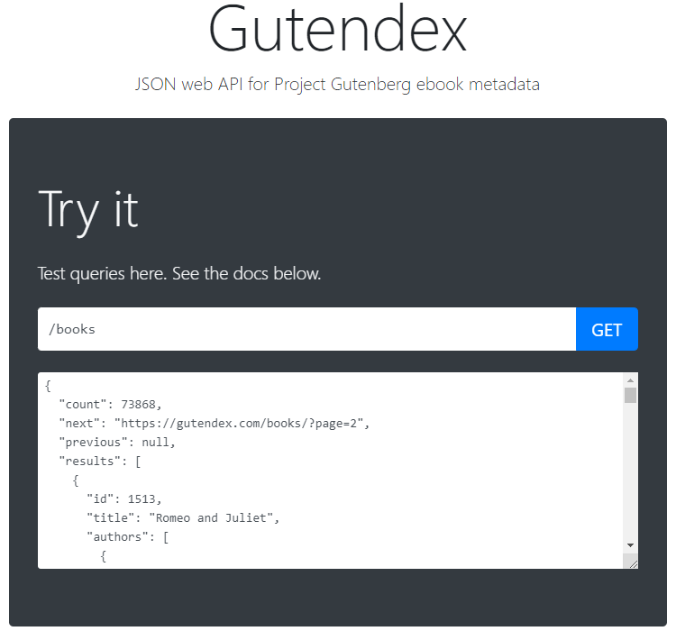

### Realizado con:

### Status del Repositorio:

## Ejemplos de Uso
### Instalación

1. Clona este repositorio:
   * `git clone https://github.com/d2mpyk/library`
2. Abre el proyecto usando [InteliJ](https://www.jetbrains.com/es-es/idea/download/?section=windows)
3. Abre la terminal y actualiza las dependencias con los siguientes comandos: 
   * `cd library`
   * `mvn install`
4. Crea la base de datos en [pgAdmin](https://www.pgadmin.org/download/), usando el comando:
   * `CREATE DATABASE biblioteca;`
5. Configura las credenciales de la API de Gutendex en el archivo de propiedades: 
   * `application.properties` 
   * `application.yml`
6. Ejecuta la aplicación.
   * `mvn spring-boot:run`

## Overview
### Menú Principal
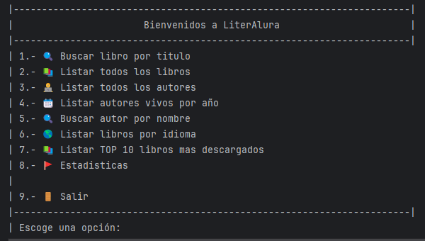
### Opción 1
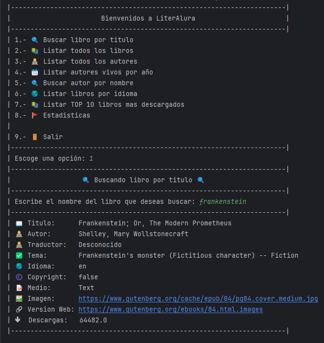
### Opción 2
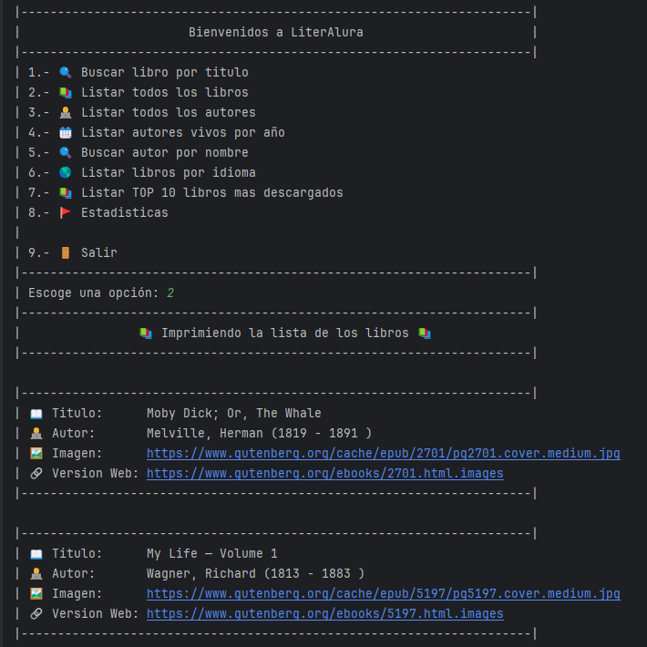
### Opción 3
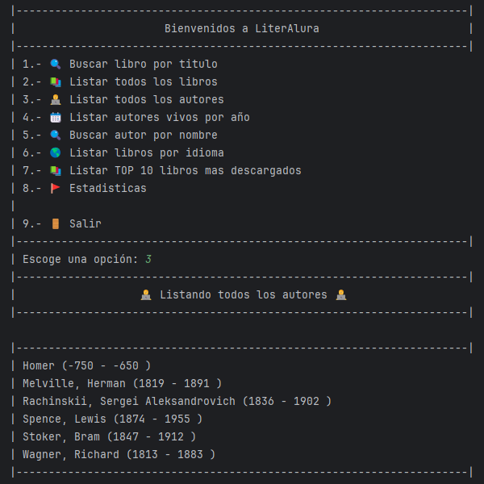
### Opción 4
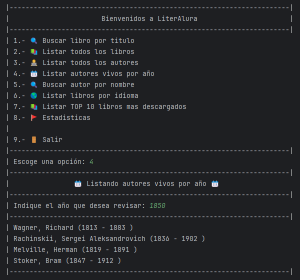
### Opción 5
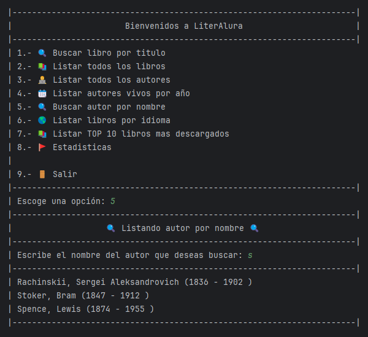
### Opción 6

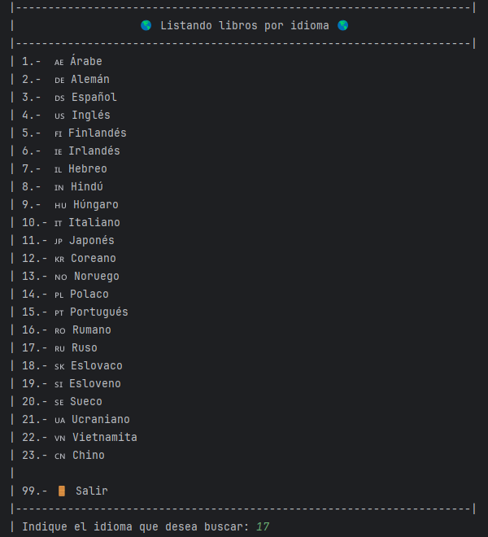
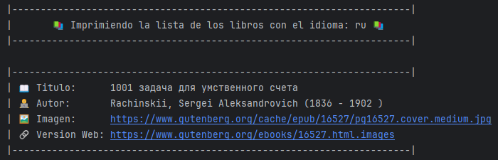
### Opción 7
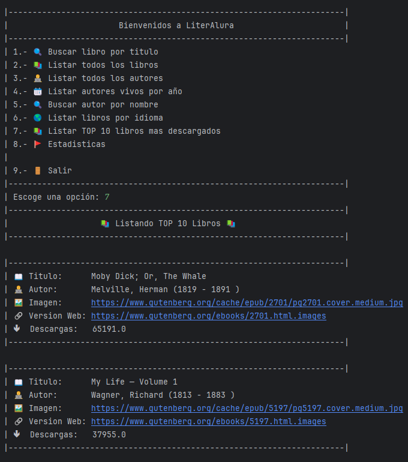
### Opción 8
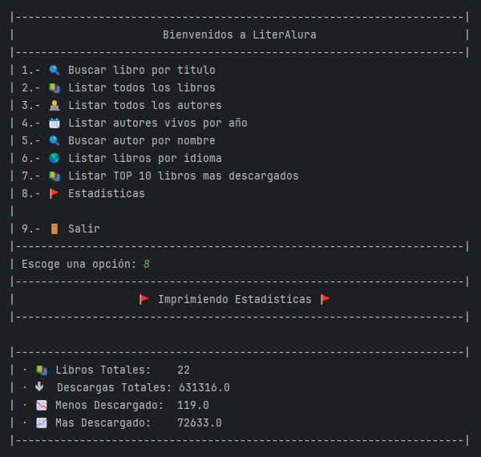
### Opción 9
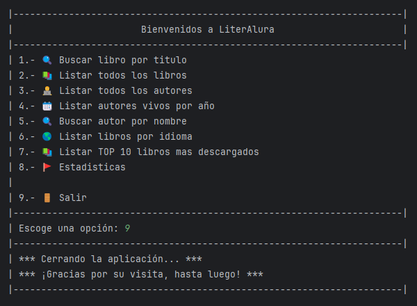

## Insignia obtenida
   

## Licencia
GNU General Public License v3.0

## Créditos
Este proyecto fue creado por Darwin Mireles.

